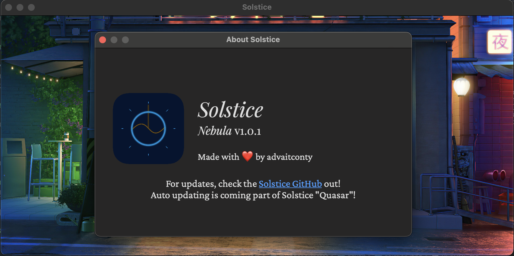

Introducing Solstice, the ultimate tracker. This is literally the only aesthetic pomodoro tracker you will ever need.

## Download

Click [here (releases tab)](https://github.com/contyadvait/Solstice/releases) to download the app. You may recieve warnings that this app is not secure but it is (review the code yourself if you want to validate this)

For the iPad app, check out [Solstice for iPad](https://www.github.com/contyadvait/Solstice-iPad)

## Features

Custom about screen (not really a feature but whatever)

Customisable backgrounds (through the ones provided in settings)

Completely customisable lengths for pomodoros and breaks

A completely custom aesthetic theme (from the start)

(Figma file provided since App Icon was designed in Figma)
